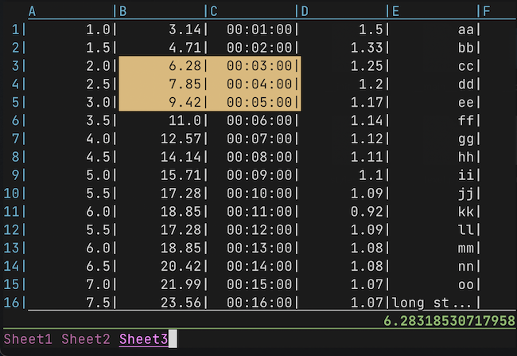

## texel - Command line interface for reading spreadsheets inside terminal.

Sometimes, you have to deal with spreadsheets. Those are sad times.
Fortunately there is texel!

Texel is a useful CLI for quickly reading spreadsheets and
copying their contents to clipboard in CSV format.

  
## Usage
```
texel [-h] [-d DELIMITER] [-c CELLWIDTH] [-p PRECISION]
             [--fillna FILLNA]
             FILE

positional arguments:
  FILE                  Spreadsheet path (csv, xls, xlsx, xlsm,
                        xlsb, odf, ods or odt)

optional arguments:
  -h, --help            show this help message and exit
  -d DELIMITER, --delimiter DELIMITER
                        Delimiter for csv files
  -c CELLWIDTH, --cellwidth CELLWIDTH
                        Width of a cell
  -p PRECISION, --precision PRECISION
                        Precision of floating point numbers
  --fillna FILLNA       Value to use to fill holes in the
                        spreadsheet
```
#### Commands
  - ⬆️⬇️⬅️➡️ / `kjhl` - Move
  - `<TAB> <SHIFT-TAB>`/`n <SHIFT-n>` - Switch sheet
  - `v` - Visual/selection mode
  - `<ESC>` - Exit visual/selection mode
  - `c` / `y` - Copy selected cell(s)
  - `?` - Help
  - `q` - Exit

#### Supported file formats:
  - xlsx
  - xlsm
  - xltx
  - xltm
  - xlsb
  - xls
  - csv
  - odt
  - odf
  - ods

## Installation

`$ pip install texel`

## Licence
MIT
